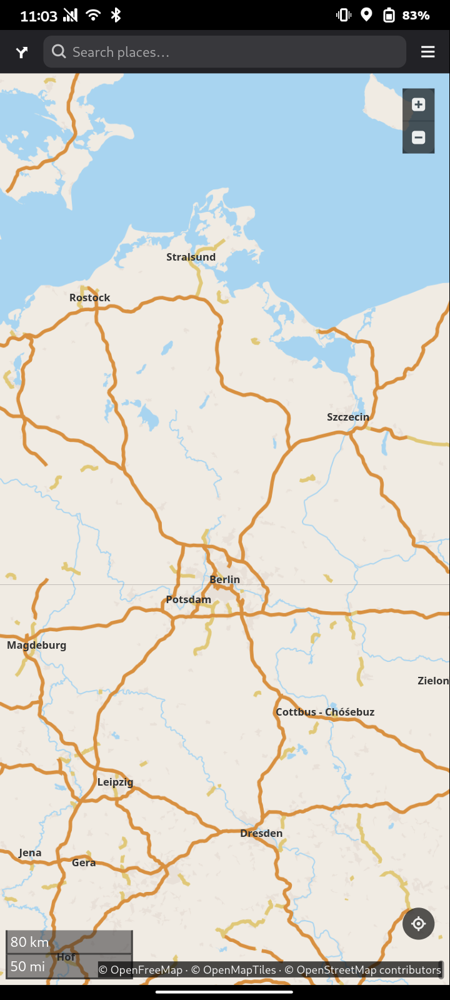
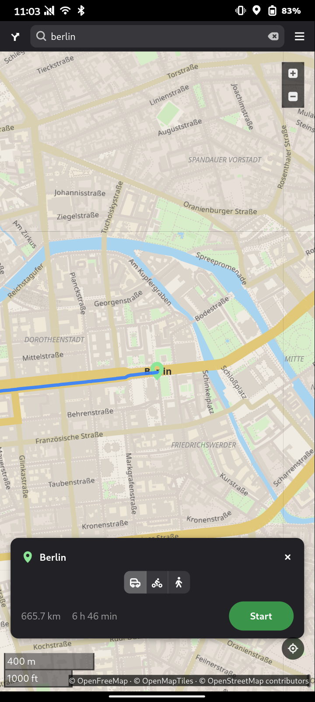
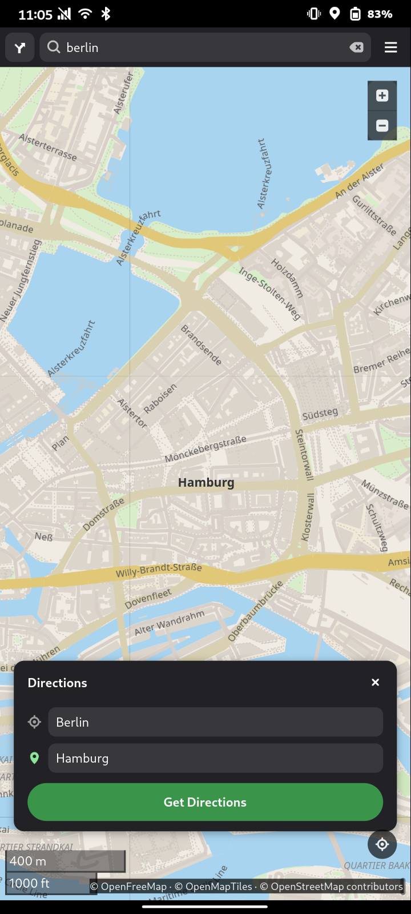
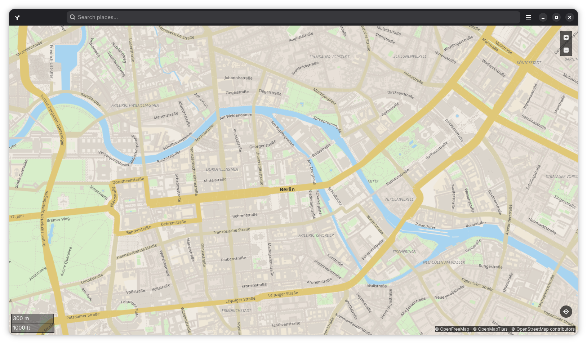

# Loci

Turn-by-turn navigation mostly aimed at Linux phones such as the Pinephone or Furiphone. Please be aware that this app is in very early stages and therefore it is not competitive with something like Pure Maps. While I tested it and you can definetely get from point a to b with Loci, I wouldnt rely on it for now. Also it might be considered AI slop, of course.

## Disclaimer

For informational purposes only. Do not use while driving. Navigation data may be inaccurate or incomplete - never rely solely on this app for navigation or safety-critical decisions. No warranty is given for accuracy or fitness for any particular purpose.

## Features so far

-  Turn-by-turn navigation with maneuver instructions
-  Routing via OSRM and Ferrostar (online mode)
-  Address search via Nominatim geocoding (online mode)
-  Offline mode using [OSM Scout Server](https://github.com/rinigus/osmscout-server) (also available as Flatpak)
-  Map rotation following direction of travel (kind of)
-  Automatic rerouting when off-route
-  Route snapping - position indicator follows the road
-  Location via the XDG Location Portal (GeoClue)
-  Screen idle inhibit during navigation
-  Map rendering (vector) using libshumate like Gnome Maps

## Screenshots

<div style="display: flex; flex-wrap: wrap; gap: 20px;">
  
  
  
  
</div>

## Credits

Inspired by [Gnome Maps](https://apps.gnome.org/en/Maps/).

## AI Disclosure

This application was built with the assistance of AI (GitHub Copilot CLI, Claude).

## Building

The easiest way to build the app is by using GNOME Builder IDE or flatpak-builder.

Example using flatpak-builder as a flatpak:
-  Install flatpak-builder
```
flatpak install org.flatpak.Builder
```

-  Compile the project into a local repo
```
flatpak run org.flatpak.Builder --repo=repo --force-clean --user build io.github.nico359.loci.json
```

-  Then create a bundle which you can install
```
flatpak build-bundle repo io.github.nico359.loci.flatpak io.github.nico359.loci
```


